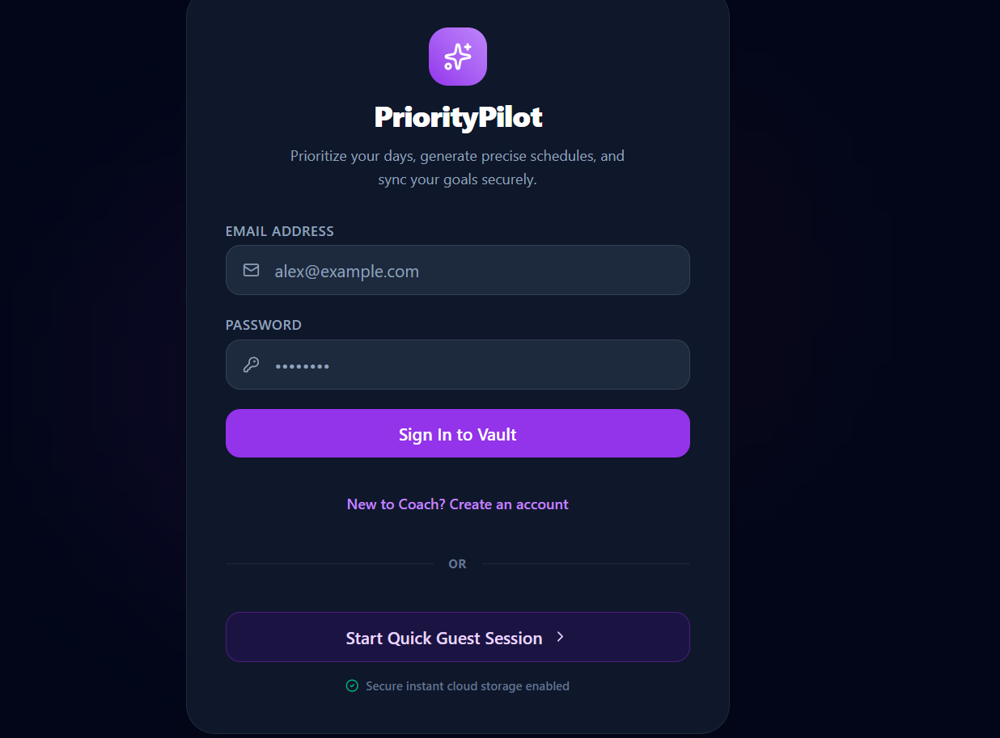
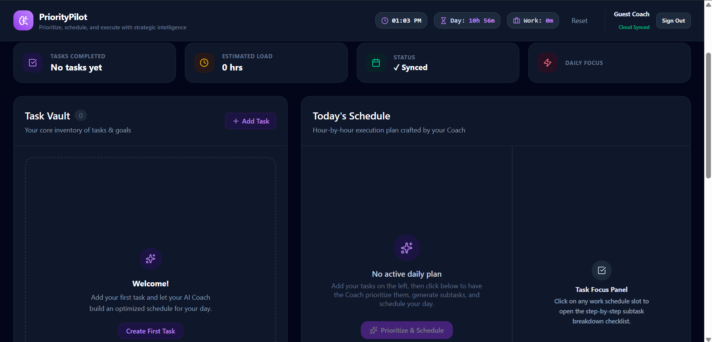
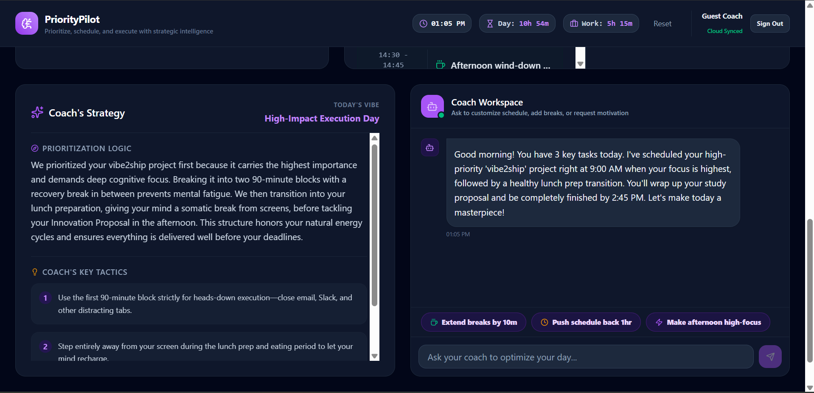
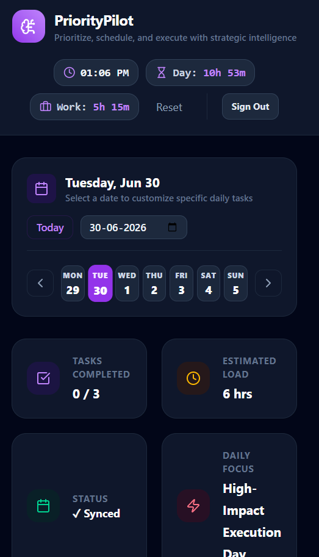

# 🚀 PriorityPilot

**PriorityPilot** is an AI-powered productivity coach that helps users prioritize tasks, generate personalized schedules, and stay ahead of deadlines using Google's Gemini AI. Instead of relying on passive reminders, PriorityPilot acts as an intelligent planning companion that proactively helps users organize, plan, and accomplish their work efficiently.

> Built for the **Vibe2Ship Hackathon 2026** – Problem Statement: **The Last-Minute Life Saver**

---

## 🌟 Features

- 📝 Create and manage tasks with deadlines, priority levels, and estimated durations.
- 🤖 AI-powered task prioritization based on urgency, importance, and workload.
- 📅 Personalized daily schedule generation.
- ✅ Automatic breakdown of tasks into actionable subtasks.
- 💡 AI-generated productivity strategies and coaching tips.
- 💬 Interactive AI Coach for conversational schedule adjustments.
- 🔄 Dynamic schedule replanning through natural language prompts.
- 📱 Responsive and modern user interface.

---

## 🛠️ Tech Stack

### Frontend
- React
- TypeScript
- CSS

### Backend
- Node.js
- Express

### AI
- Google Gemini API
- Google GenAI SDK

### Deployment
- Google Cloud Run

---

## ☁️ Google Technologies Used

- Google AI Studio
- Gemini API
- Google GenAI SDK
- Google Cloud Run

---

## 📸 Screenshots

> Screenshots have been attched.
### Login Screen

### Dashboard


### AI Generated Schedule
.png)

### Productivity Strategy


### Mobile View


---

## ⚙️ Installation

Clone the repository:

```bash
git clone https://github.com/YOUR_USERNAME/prioritypilot.git
```

Navigate into the project:

```bash
cd prioritypilot
```

Install dependencies:

```bash
npm install
```

Create a `.env` file and add your Gemini API key:

```env
GEMINI_API_KEY=YOUR_API_KEY
```

Run the development server:

```bash
npm run dev
```

---

## 🎯 Problem Statement

### The Last-Minute Life Saver

Students and professionals frequently miss deadlines because traditional reminder applications rely on passive notifications. PriorityPilot transforms productivity by acting as an intelligent AI planning agent that proactively prioritizes tasks, generates personalized schedules, explains its reasoning, and adapts plans based on user interactions.

---

## 🧠 How It Works

1. Add your tasks with deadlines, priorities, and estimated durations.
2. Gemini analyzes your workload.
3. The AI generates an optimized daily schedule.
4. Each task is broken down into actionable subtasks.
5. The AI provides strategic reasoning and personalized productivity advice.
6. Users can conversationally modify their schedule through the AI Coach.

---

## 🌍 Live Demo

**Google Cloud Deployment:**

https://prioritypilot-736240737663.us-west1.run.app

---

## 👩‍💻 Author

**Sushree Subhangini Mohanty**

Built for the **Vibe2Ship Hackathon 2026** using Google AI technologies.

---

## 📄 License

This project is developed for educational and hackathon purposes.
